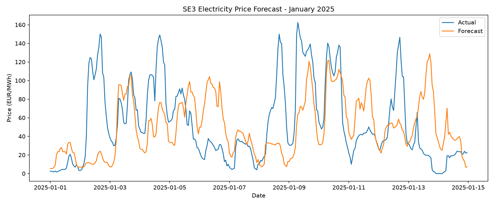
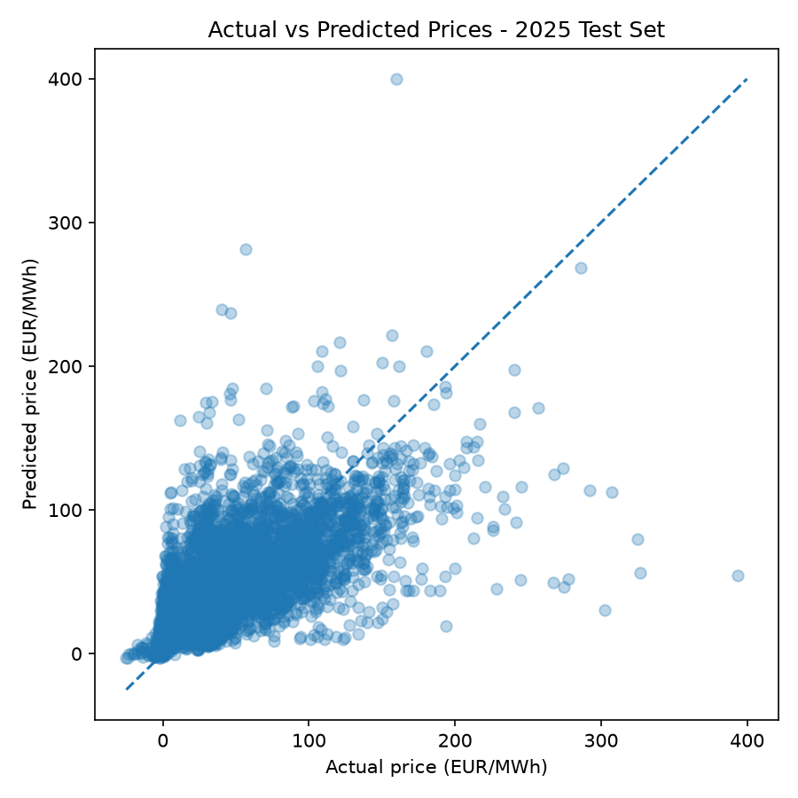

# Electricity Forecasting

Machine learning project for forecasting day-ahead electricity prices in the Swedish SE3 bidding zone.

# SE3 Electricity Price Forecasting

This project was done to evaluate a simple baseline model as well as two regression models when predicting the price of electricity in the SE3 bidding zone

## Problem
The goal of this project is to train and compare regression models for predicting electricity prices in the SE3 bidding zone.

## Data
The data is from Svenska Kraftnät and spans from 2020-01-01 to 2025-09-30. The data had to
be cleaned and processed to be able to be trained on the models

The models are evaluated using a time-based split rather than a random train-test split, since the data is a time series.

The raw data was cleaned and processed before training. Missing hourly timestamps were identified, and the data was put on a continuous hourly time grid.

## Features
24h, 48h, 168h lag
cyclic hour/day features

## Models
Linear Regression
Gradient Boosting

## Validation strategy
2020–2023 training
2024 validation
2025 test

## Results
Validation 2024
Linear Regression
MAE:  18.97
RMSE: 30.99

Gradient Boosting
MAE:  18.14
RMSE: 30.32

Final Gradient Boosting test, Jan–Sep 2025
MAE:  21.32
RMSE: 31.37

## Limitations
Only historical prices/calendar information
Extreme price spikes are difficult to predict which can be clearly seen in the plots when run.

Additional features such as weather and power demand could potentially improve the models.
