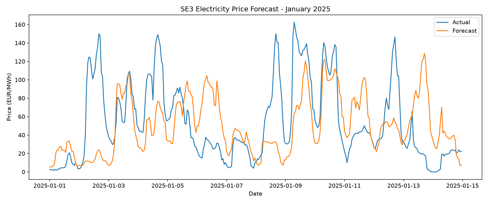
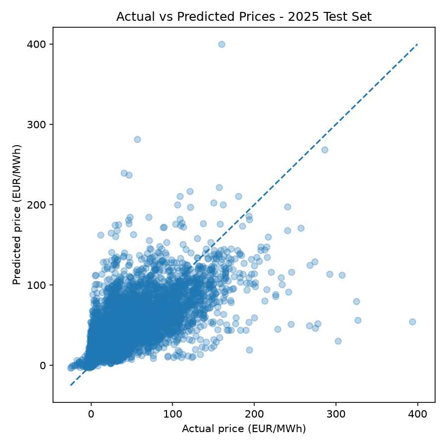
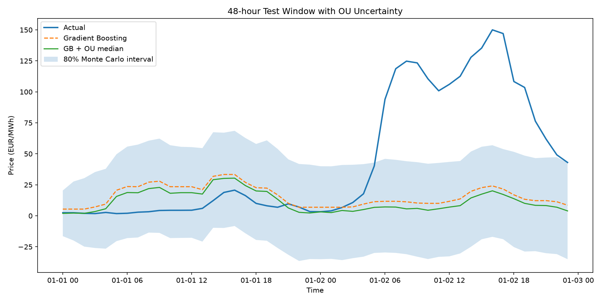

# SE3 Electricity Price Forecasting

Machine learning project for forecasting hourly electricity prices in the Swedish SE3 bidding zone, with an additional stochastic extension for modelling forecast uncertainty.

## Problem

The goal of this project is to train and compare regression models for predicting electricity prices in the SE3 bidding zone.

The project also explores whether a stochastic model of forecast residuals can provide useful information about short-term forecast uncertainty.

## Data

The data is from Svenska kraftnät and spans from 2020-01-01 to 2025-09-30.

The raw data was cleaned and processed before training. Missing hourly timestamps were identified, and the data was placed on a continuous hourly time grid.

Since electricity prices form a time series, the models are evaluated using chronological train, validation and test periods rather than a random train-test split.

## Features

The current forecasting models use:

- 24-hour price lag
- 48-hour price lag
- 168-hour price lag
- cyclic hour-of-day features
- cyclic day-of-week features

## Models

Two regression models are compared:

- Linear Regression
- Gradient Boosting

Gradient Boosting is selected based on validation performance.

## Validation strategy

- 2020–2023: training
- 2024: validation
- Jan–Sep 2025: final test

## Results

### Validation 2024

| Model | MAE | RMSE |
|---|---:|---:|
| Linear Regression | 18.97 | 30.99 |
| Gradient Boosting | 18.14 | 30.32 |

### Final Gradient Boosting test, Jan–Sep 2025

- MAE: 21.32
- RMSE: 31.37

## Stochastic residual modelling

As an extension to the point forecasting model, an Ornstein-Uhlenbeck (OU) process was fitted to the Gradient Boosting validation residuals.

The purpose of this extension was to explore whether forecast errors exhibit mean-reverting behaviour and to use the fitted stochastic process to generate Monte Carlo prediction intervals.

Estimated OU parameters on the 2024 validation residuals:

- kappa: 0.1316
- mu: -4.0573
- sigma: 15.4125
- residual half-life: 5.27 hours

### Rolling 24-hour evaluation

To avoid evaluating across missing timestamps, the stochastic model was evaluated only on contiguous 24-hour windows in the 2025 test period.

This resulted in 203 valid windows covering 4,872 test hours.

| Model | MAE | RMSE |
|---|---:|---:|
| Gradient Boosting | 20.63 | 29.01 |
| Gradient Boosting + OU median | 18.41 | 26.69 |

The nominal 80% Monte Carlo prediction interval achieved 86.2% empirical coverage, with an average interval width of 70.72 EUR/MWh.

The rolling evaluation indicates that short-term mean reversion in the forecast residuals can contain useful predictive information. The OU model is included primarily as a stochastic modelling extension rather than as a replacement for the main machine-learning forecasting model.

*Example 48-hour test window showing the Gradient Boosting point forecast, OU-adjusted Monte Carlo median and an 80% prediction interval.*

## Limitations and next steps

The current forecasting models use only historical electricity prices and calendar features. This limits their ability to anticipate price movements caused by changes in demand, weather, renewable generation and other market conditions.

The Gaussian OU residual model captures mean-reverting forecast errors but does not fully represent extreme electricity-price movements and heavy-tailed residual behaviour.

The stochastic OU component was added mainly to explore probabilistic forecasting and connect the project to stochastic-process modelling.

The next practical extension will focus on adding exogenous features such as:

- electricity demand / load
- weather variables
- wind and solar generation
- other generation or market fundamentals

These features are likely to be more important for improving the underlying point forecast than further increasing the complexity of the stochastic residual model.